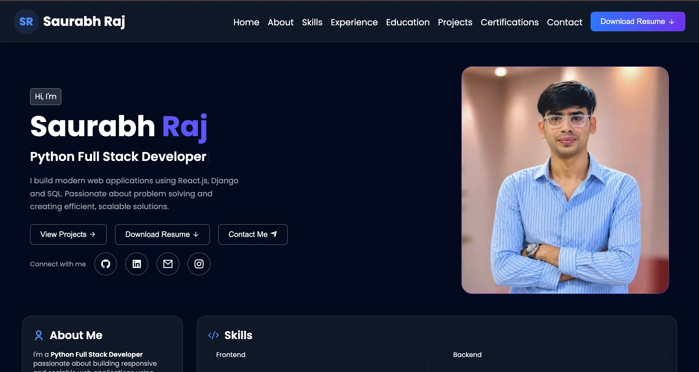

# 🌐 Personal Portfolio

A modern and responsive personal portfolio website built using React.js.  
This portfolio showcases my skills, projects, experience, education, certifications, and provides a way to connect with me.

---

## 🚀 Features

- ✨ Modern and clean UI
- 📱 Fully responsive design
- 👨‍💻 About Me section
- 🛠️ Skills & technologies
- 💼 Experience section
- 🎓 Education section
- 📜 Certifications section
- 🚀 Dynamic projects section
- 📬 Contact section
- 🔗 Social media integration
- 📄 Resume download
- 🎨 Smooth animations and interactions

---

## 🛠 Tech Stack

- React.js
- JavaScript
- HTML5
- CSS3
- Vite
- Remix Icon

---

## 📸 Preview

---

## 🚀 Live Demo

👉 [Click here to view live](https://saurabhraj.site)

---

## 🙌 Author

Saurabh Raj

---

## ⭐ Support

If you like this project, give it a ⭐ on GitHub!
